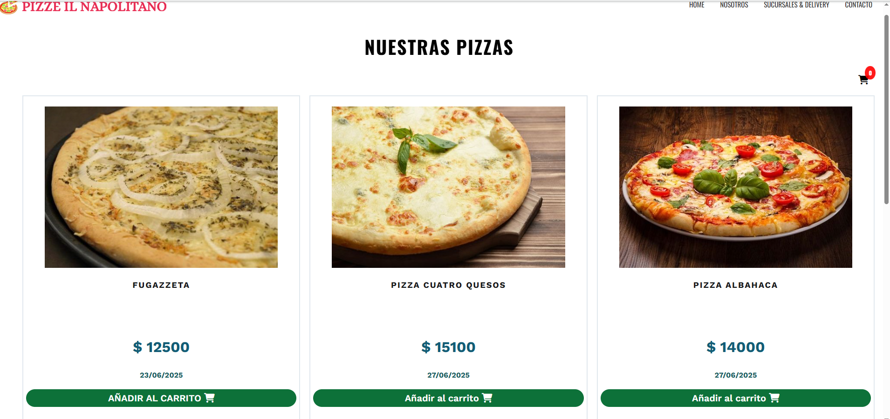
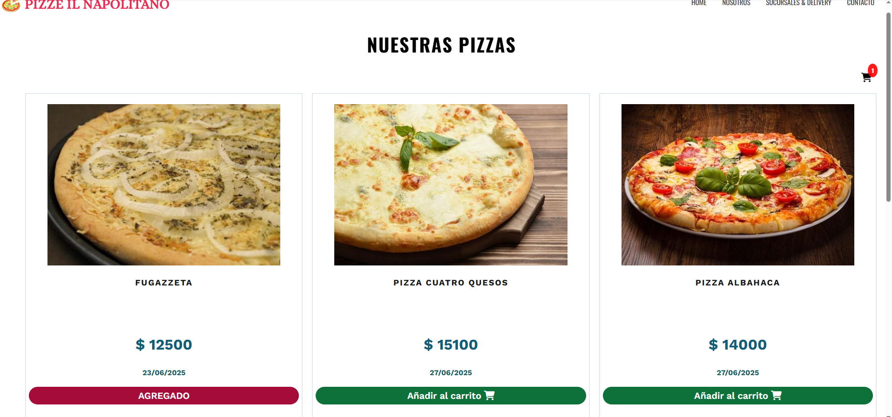
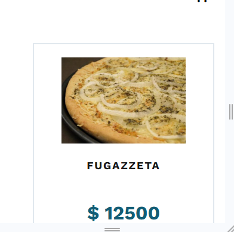

# Projyecto pizzeria

Aplicación web que presenta un catalogo de pizzas con funcionalidad de carrito de compras, permitiendo a los usuarios agregar productos y ver el total de su pedido

## Tecnologías utilizadas

- Desarrollado con HTML5/CSS3 
- Diseño responsive
- Vanilla JavaScript
- Animate.css para animaciones

## funcionalidades del carrito

- Agregar productos con un solo clic
- Prevención de duplicados
- Contador visual de productos
- Cálculo automático del total
- Indicador visual cuando un producto es agregado

## Screenshots

## Autor
- [@Nazareno C] (https://github.com/N4z4G17)

## Licencia
[MIT](https://choosealicense.com/licenses/mit/)
